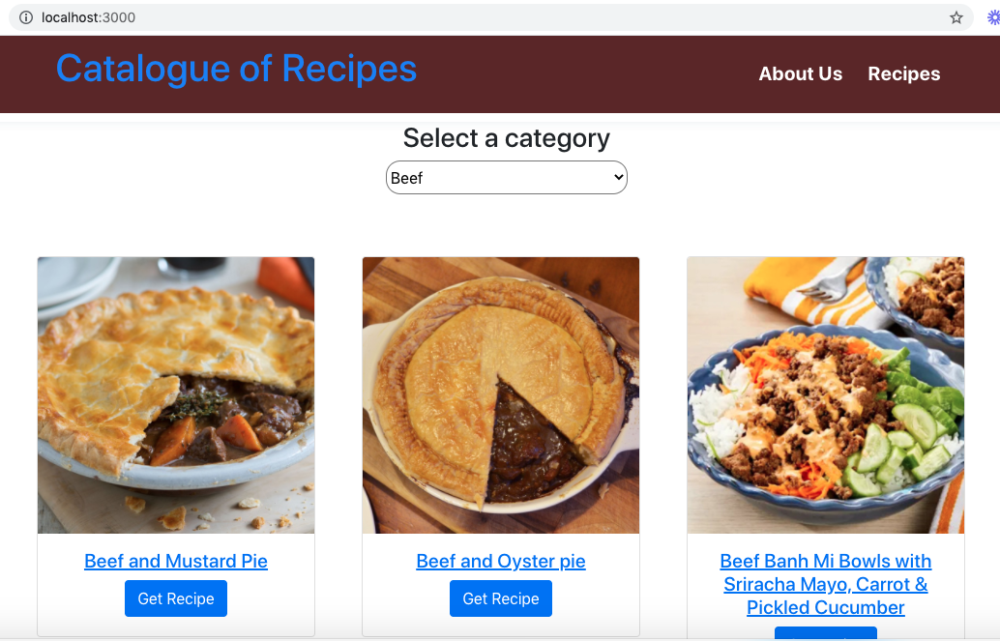

  <h3 align="center">React & Redux Capstone - Catalogue of Recipes</h3>

<!-- TABLE OF CONTENTS -->
## Table of Contents

* [About the Project](#about-the-project)
  * [Built With](#built-with)
* [Getting Started](#getting-started)
  * [Prerequisites](#prerequisites)
  * [Installation](#installation)
* [Contributing](#contributing)
* [License](#license)
* [Author](#author)
* [Show your support](#show-your-support)
* [Acknowledgements](#acknowledgements)

## Screenshot
 

## Live Demo

[Live Demo]( https://fathomless-basin-96851.herokuapp.com/)

<!-- ABOUT THE PROJECT -->
## About The Project

This project is the Capstone project for the React & Redux Module of the Microverse Technical Curriculum. It is based on a catalogue of recipes. It is a browsable list of items that you can filter and access to the details of one item.

### Built With
This project was built using the technologies below.
* Node.js
* React
* React-DOM
* react-create-app
* Redux
* npm
* CSS
* Bootstrap
* ES6

## Getting Started

To get a local copy up and running follow these simple example steps.

### Prerequisites
This is an example of how to list things you need to use the software and how to install them.
* npm

`npm install npm@latest -g`

### Installation
1. Clone the repo

`https://github.com/t-yanick/recipe-catalogue.git`

2. Install NPM packages

`npm install`

3. Run

`npm start`

Runs the app in the development mode.
Open http://localhost:3000 to view it in the browser.

4. Run

`npm test`

Launches the test runner in the interactive watch mode.
See the section about [running tests](https://facebook.github.io/create-react-app/docs/running-tests) for more information.

5. Run

`npm run build` 

Builds the app for production to the build folder.
It correctly bundles React in production mode and optimizes the build for the best performance.

The build is minified and the filenames include the hashes.
Your app is ready to be deployed!

See the section about [deployment](https://facebook.github.io/create-react-app/docs/deployment) for more information.

## Contributing

Contributions are what make the open source community such an amazing place to be learn, inspire, and create. Any contributions you make are <b>greatly appreciated.</b>

1. Fork the Project
2. Create your Feature Branch (`git checkout -b feature/newFeature`)
3. Commit your Changes (`git commit -m 'Add some newFeature'`)
4. Push to the Branch (g`it push origin feature/newFeature`)
5. Open a Pull Request

## License

Distributed under the MIT License. See [LICENSE](https://opensource.org/licenses/MIT) for more information.

## Author

👤 **Tazoh Yanick Tazoh**

- LinkedIn: [Tazoh Yanick Tazoh](https://www.linkedin.com/in/tazoh-yanick-tazoh/)
- GitHub: [@t-yanick](https://github.com/t-yanick)
- Twitter: [@ElTazoh](https://twitter.com/ElTazoh)

## Show your support

Give a :star: if you like this project!

## Acknowledgments

* Microverse
* Github
* The Thanatos Team

